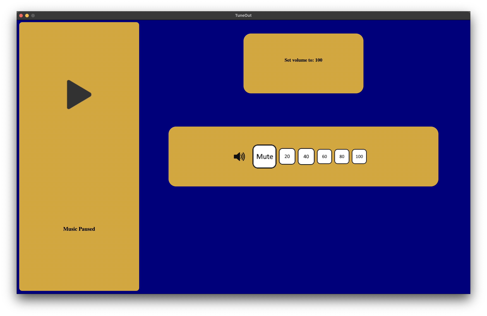
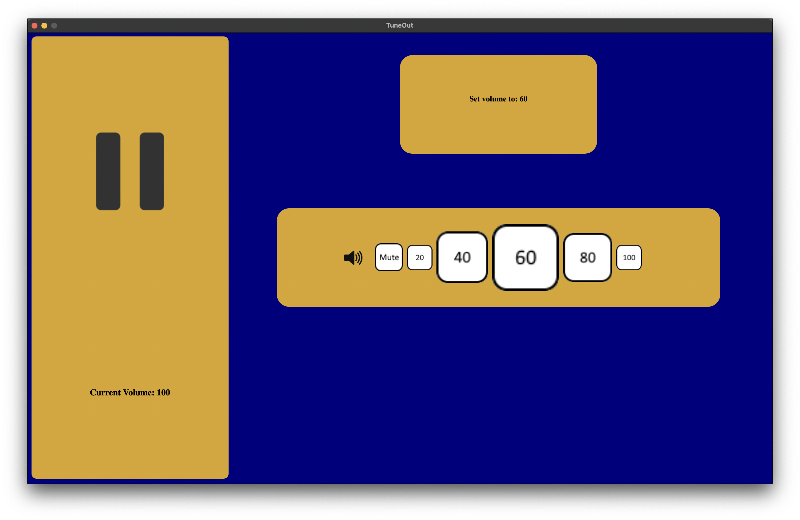
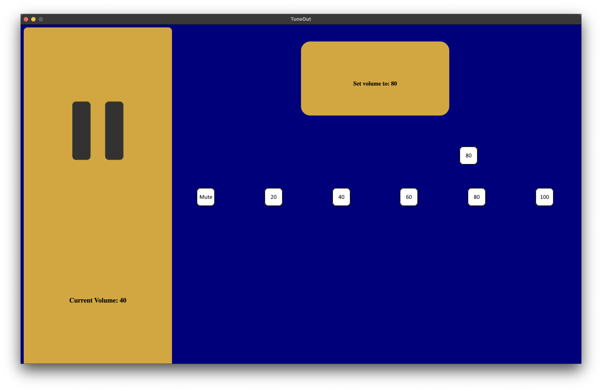
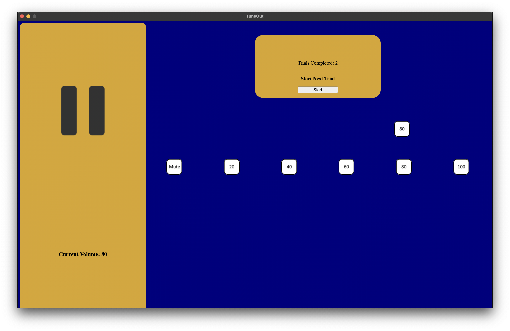
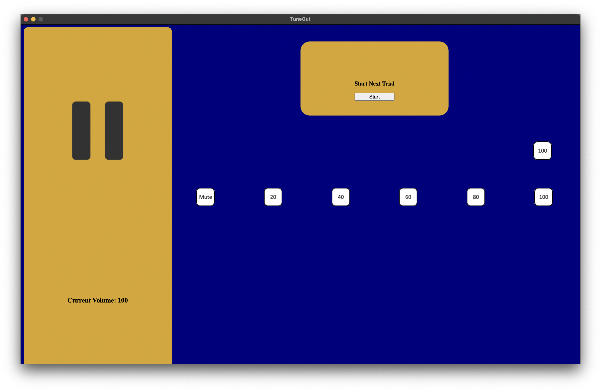

# Target-Selection-Techniques

> - A collection of two icon selection techniques that are used to control the volume of an audio player.

---

### Usage

> 1. Go [to GitHub](https://github.com/electron/fiddle/releases/tag/v0.15.1) to download [Electron Fiddle](https://www.electronjs.org/)
> 2. Download the repository files and open using [Electron Fiddle](https://www.electronjs.org/)

---

> 

---

---

> 
